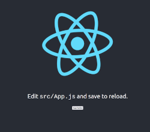

# First fullstack deploy - Express / React - on Heroku server

[](https://fullstack-peanuts83.herokuapp.com/)

ref : HARDCODERS -  https://www.youtube.com/watch?v=klEs4oi3Igc

L'objectif est de déployer un serveur nodeJS/Express ET une app React sur un serveur et de gérer les adressages dynamiques de routes API.
Il s'agit d'un premier essai fonctionnel. D'autres solutions plus efficaces existent à coup sûr...

Online demo : https://fullstack-peanuts83.herokuapp.com/

# Serveur NodeJS / Express

NodeJS est le langage serveur javascript, Express est un framework nodeJS qui facilite la mise en place de serveurs JS.
Il s’agit ici de la mise en place d’un mini projet Express/React qui communique depuis un serveur de la plateforme Heroku. Pour la partie React, consulter la section correspondante.

La structure du projet est la suivante :

Projet

+---- front

+---- build

+---- src

+---- package.json

+- server.js

+- package.json
Initialisation

## Initialisation

Installer nodeJS et npm, puis créer un projet nodeJS.

```bash
npm init
```

Répondre Yes aux invites. Au  main, mettre index.js ou server.js. Ce sera le point d’entrée du projet.

Il faut ensuite installer les dépendances, ici **express** et **dotenv** (pour accéder aux variables d’environnement). La dev dependency **nodemon** permet un hot reload du serveur à chaque changement de code, pratique pour ne pas avoir à relancer le serveur en permanence!

```bash
npm i express dotenv
npm i -D nodemon      // -D = save in devDependencies
```

Paramétrer les scripts du **package.json** pour un lancement auto de l’app avec start et un auto reload par nodemon avec watch.

```bash
"scripts": {
  "start": "node server.js",
  "watch": "nodemon server.js"
}
```

Les scripts se lancent avec run (sauf start).

```bash
npm start
npm run watch
```

## Le serveur

Express est importé dans **server.js** et attribué à app.
dotenv est appelé et configuré en direct pour l’accès aux variables d’environnement (dans un fichier .env à la racine du projet). Ces variables seront paramétrées sur le serveur de production au déploiement si ## besoin.

```bash
const express = require('express')
const path = require('path')
require('dotenv').config()

const app = express()
const PORT = process.env.PORT || 5000
app.use(express.json())

// Indique la cible du serveur -> la SPA React!
app.use(express.static('front/build'))

// Retour de l'API sur l'adresse localhost:5000/api/test -> msg: 'Hello world!'
app.get('/api/test', (req, res) => {
console.log('test successfull!')  // dans la console du serveur
res.send({
  msg: "Hello world!"             // dans la page du front localhost:5000/api/test
}) })

// Précise le fichier qui reçoit les res(ponses) du serveur
app.get('/*', (req,res) => {
  res.sendFile(path.join(__dirname, ('client/build/index.html')))
})

app.listen(PORT, () => {
  console.log(`Le serveur est lancé sur le port ${PORT}`)
})
```

## Paramètres

Au niveau du serveur, modifier le **package.json** pour ajouter un launcher du front depuis le back.

Les 3 autres scripts permettent de déclencher après le build Heroku (service de déploiement) l’installation des dépendances du front et du front sur le serveur.

```bash
"scripts": {
  "client": "cd client && npm start",
    "install-front": "cd front && npm install",
    "build": "cd front && npm run build",
    "heroku-postbuild": "npm run install-front && npm run build",
}
```


Il est important de préciser également la version de nodeJS employée, afin que le serveur installe la bonne!

```bash
"engines": {
    "node": "14.x"
  },
```

## Déploiement sur Heroku

Le déploiement s’opère en 2 phases :

1 - **Initialiser le projet avec git** - Le projet doit être initialisé avec git, puis les fichiers sont add . et un commit est créé. A ce stade le projet est prêt à être publier sur Heroku…

```bash
git init
git add .
git commit -m "first commit"
```


2 - **Création d’un projet Heroku** - Le projet est créé avec la CLI Heroku (ne pas oublier de se logger!).

```bash
heroku login
heroku create fullstack-tom   // le nom est optionnel

git push heroku main          // le nom de la branche qui porte le projet en local
```


On peut alors vérifier le projet en local, puis en remote.

```bash
heroku local
heroku open
```

# React - create-react-app

Dans le répertoire du projet Express, créer un projet React dans un répertoire front.

```bash
npx create-react-app front
```

## Lier React à l’API

On conserve ici l’app minimale fournie à l’installation du projet. Seul un bouton “Say hello” est ajouté qui va permettre de démontrer le lien à l’API.

La question principale au niveau du front est l’adressage correct des requêtes API. Ainsi, le fetch se voit assigner une adresse tronquée (la partie finale), le protocol et le nom de domaine étant gérés en local par un proxy qui est renseigné dans le package.json du projet front.

Pour ce qui est de la gestion de cette partie coté serveur de prod, la question demeure… Etant dans le même répertoire, le domaine est commun, je supose que la solution est là!

**app.js**
```javascript
import React, { useRef, useState } from 'react'
import logo from './logo.svg';
import './App.css';

function App() {
  // le clickBtn déclenche un fetch de l'API qui renvoi un objet msg... //
  const msg = useRef()
  const [message, setMessage] = useState('')
  async function handleClick() {
    const data = await fetch('/api/test')
    const json = await data.json()
    // le contenu de msg est assigné à message qui s'affiche sous le btn //
    setMessage(json.msg)
  }

  return (
    <div className="App">
      <header className="App-header">
        
        <p>
          Edit <code>src/App.js</code> and save to reload.
        </p>
        <button onClick={handleClick}>
          Say hello
        </button>
        <p ref={msg}>{message}</p>
      </header>
    </div>
  );
}

export default App;
```


**package.json**  // adresse du serveur en local

```bash
"proxy": "http://localhost:3000"
```
Le proxy n'est utilisé que par la version de dev.

Ultime subtilité, un "git init" étant d'office opéré par *create-react-app*, il est nécessaire de supprimer cet init afin de n'avoir qu'un seul dossier git pour l'ensemble du projet. Cette commande doit être effectuée DANS le répertoire *front*.

```bash
rm -rf .git
```